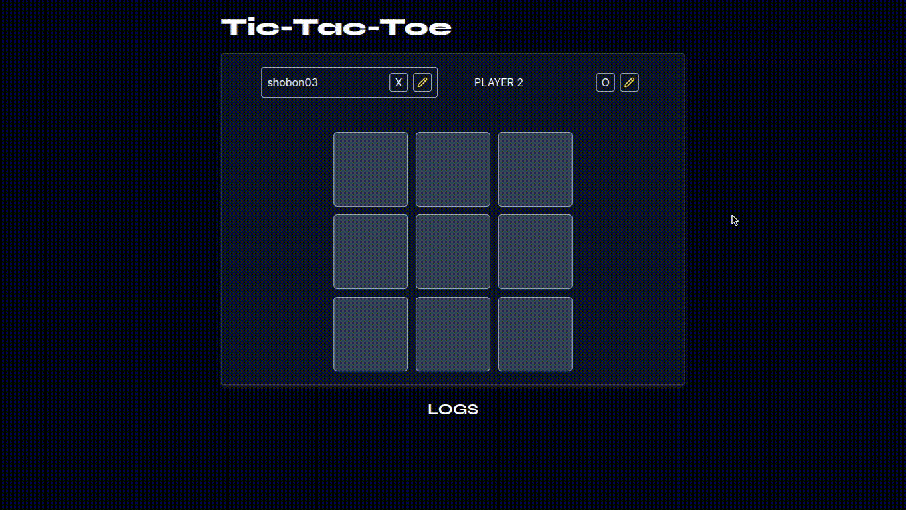

# tic-tac-toe in React

This is a little local Tic-Tac-Toe game written in React.

This has taught me concepts I've never used in React.

It was a fun project to make.

## Acknowledgement

It was made in as my first project of the React course from Maximilian Schwarzmüller (Academind).

## Dependencies + stack

This project was made with 🩷 and:

- Bun
- Vite
- React w/ Typescript
- Framer motion
- TailwindCSS

## Screenshots

